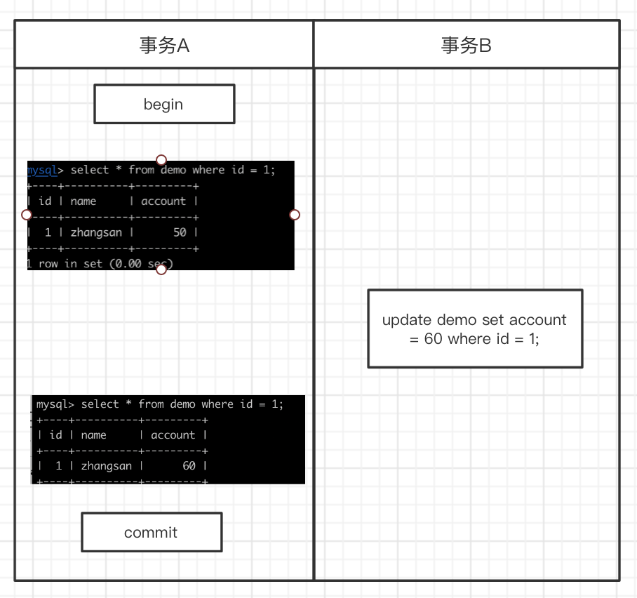

事务隔离级别

| 隔离级别      | 脏读   |  不可重复读  | 幻读  |
| --------   | -----:  | :----:  | :----:  |
| 读未提交     | 可能 |   可能     | 可能     |
| 读提交      |   不可能   |   可能   | 可能   |
| 可重复读    |   不可能  |   不可能   | 可能   |
| 串行化      |   不可能    |  不可能  | 不可能  |

以下操作需要先修改事务隔离级别

    可以修改my.cnf transaction_isolation
    
    也可以通过命令修改事务隔离级别 set global transaction isolation level read committed;

读未提交（READ UNCOMMITTED）
    
   
    
    事务B能够读取到事务A未提交的内容

读提交 （READ COMMITTED）

   
   
    事务B能能读取到事务A未提交的内容
   
    事务A提交之后，事务B能看到事务A修改的内容
    
    会产生不可重复读问题，如下图
    
   
   
    也会产生幻读
    
   
    

可重复读 （REPEATABLE READ）, Mysql 默认隔离级别
    
    解决了不可重复读的问题
    
   
   
    同样会产生幻读, 防止部分幻读? todo 
    
   

串行化 （SERIALIZABLE）

    不会产生幻读问题
    
   