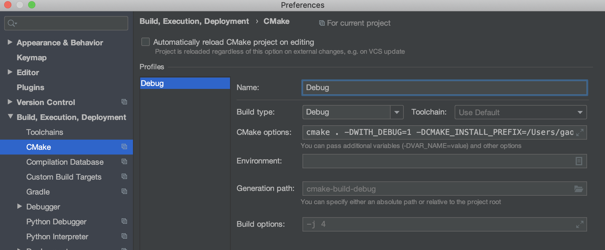
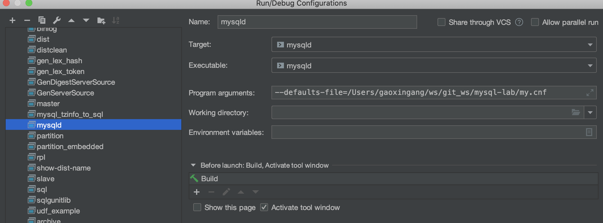
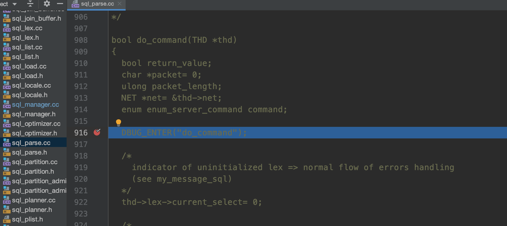

#### Mac Clion Mysql5.6 源码环境搭建

1.下载Clion 

    www.jetbrains.com/clion/

2.编译安装Mysql

    1.下载源码
    
    wget wget http://dev.mysql.com/get/Downloads/MySQL-5.6/mysql-5.6.33.tar.gz
    tar -xzvf mysql-5.6.33.tar.gz
    
    2.生成目录
    
    mkdir -p build_out/data
    
    3.编译
    
    cmake . -DWITH_DEBUG=1 \
    -DCMAKE_INSTALL_PREFIX=build_out \
    -DMYSQL_DATADIR=build_out/data
    make && make install
    
    4.初始化mysql数据库
    
    cd build_out
    scripts/mysql_install_db
  
3.Clion配置

    3.1 配置cmake
        
   
        
        cmake . -DWITH_DEBUG=1 -DCMAKE_INSTALL_PREFIX=/Users/gaoxingang/ws/git_ws/source_read/mysql-lab/build_out
        
        -DCMAKE_INSTALL_PREFIX 为编译后生成的目录
    
    3.2 配置 mysqld 启动参数
    
   
    
        --defaults-file=/Users/gaoxingang/ws/git_ws/mysql-lab/my.cnf
        
        可参考的 my.cnf 配置如下
        
        [mysqld]  
        log-error=log.err
        datadir=data
        pid-file=user.pid
        skip-grant-tables
        innodb_file_per_table=1
        port=33060
        transaction_isolation = READ-COMMITTED
         
        [client]
        # 客户端来源数据的默认字符集
        default-character-set = utf8mb4
        [mysqld]
        # 服务端默认字符集
        character-set-server=utf8mb4
        # 连接层默认字符集
        collation-server=utf8mb4_unicode_ci
        [mysql]
        # 数据库默认字符集
        default-character-set = utf8mb4
    
4.点击 debug 按钮进行调试
    
    sql_parse.cc的do_command函数打一个断点,随便执行一个sql
    
   

    
    
    
